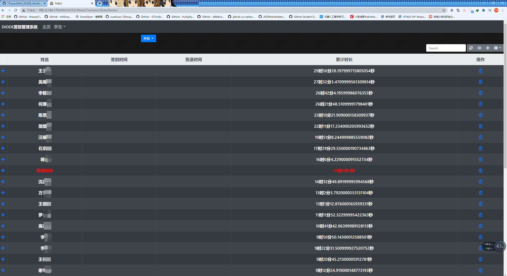

# DIODE战队人员工作时长排行榜
## 简介
为了更好地管理实验室人员出勤情况，在实验室已有的微信小程序的基础上，  
利用小程序云开发的HTTPAPI和很方便的Linux+Django+MySQL+BootStrap(Table)的一套web开发框架  
实现了简单的实验室出勤榜单，大家快来一起成为卷卷人吧！
## 效果图

## 后续
总时长榜的逻辑还没有想好，等哪天我卷起来了再写！  
数据库结构没有图，就自己看看代码推一下吧  
